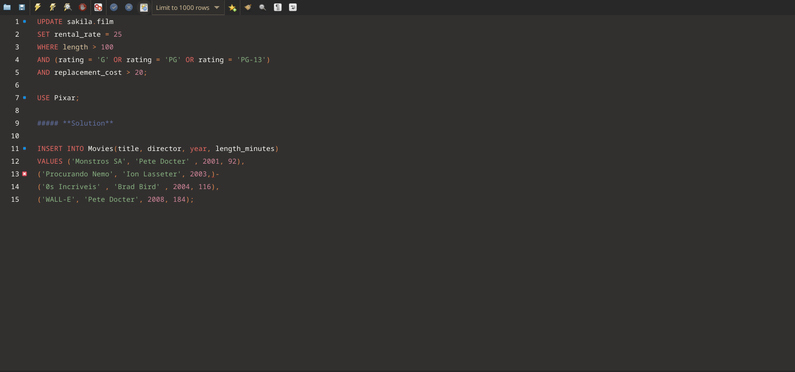

# Gruvbox-material for [MySQL Workbench](https://www.mysql.com/products/workbench/)

> A dark theme for [MySQL Workbench](https://www.mysql.com/products/workbench/)



## Install

I based this colorscheme on Dracula, so you can find all the instuctions for installation at [draculatheme.com/mysql-workbench](https://draculatheme.com/mysql-workbench).
Obviously when cloning the repo you will need to clone this repo, not the Dracula one.
```
git clone https://github.com/Zi0LEO/mysql-workbench.git
```  

## License

[MIT License](./LICENSE)

## Inspiration

The color palette is taken from [sainnhe/gruvbox-material](https://github.com/sainnhe/gruvbox-material)
The code is based on [dracula/mysql-workbench](https://github.com/dracula/mysql-workbench)
A huge thanks to all the maintainers of these amazing repos
